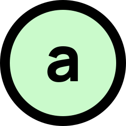

<!-- Readme template from: https://github.com/othneildrew/Best-README-Template -->

<a id="readme-top"></a>

<!-- PROJECT SHIELDS -->
<!--
*** I'm using markdown "reference style" links for readability.
*** Reference links are enclosed in brackets [ ] instead of parentheses ( ).
*** See the bottom of this document for the declaration of the reference variables
*** for contributors-url, forks-url, etc. This is an optional, concise syntax you may use.
*** https://www.markdownguide.org/basic-syntax/#reference-style-links
-->

<div align="center">

<!-- [![Contributors][contributors-shield]][contributors-url] -->
<!-- [![Forks][forks-shield]][forks-url] -->
<!-- [![Stargazers][stars-shield]][stars-url] -->
<!-- [![Issues][issues-shield]][issues-url] -->
<!-- [![Unlicense License][license-shield]][license-url] -->
<!-- <br /> -->

</div>

<!-- [![LinkedIn][linkedin-shield]][linkedin-url] -->

<!-- PROJECT LOGO -->
<div align="center">
  <a href="https://github.com/nycrat/assessori">
    
  </a>

<h3 align="center">assessori</h3>

  <p align="center">
    Easily format written assessments (tests, quizzes, exams)
    <br />
    <!-- <a href="https://github.com/nycrat/assessori"><strong>Explore the docs »</strong></a> -->
    <!-- <br /> -->
    <!-- <br /> -->
    <a href="https://nycrat.github.io/assessori">Try App</a>
    <!-- &middot; -->
    <!-- <a href="https://github.com/nycrat/assessori/issues/new?labels=bug&template=bug-report---.md">Report Bug</a> -->
    <!-- &middot; -->
    <!-- <a href="https://github.com/nycrat/assessori/issues/new?labels=enhancement&template=feature-request---.md">Request Feature</a> -->
  </p>
</div>

<!-- TABLE OF CONTENTS -->
<details>
  <summary>Table of Contents</summary>
  <ol>
    <li>
      <a href="#about-the-project">About The Project</a>
      <ul>
        <li><a href="#built-with">Built With</a></li>
      </ul>
    </li>
    <li>
      <a href="#getting-started">Getting Started</a>
      <ul>
        <li><a href="#prerequisites">Prerequisites</a></li>
        <li><a href="#installation">Installation</a></li>
      </ul>
    </li>
    <li><a href="#usage">Usage</a></li>
    <li><a href="#roadmap">Roadmap</a></li>
    <li><a href="#contributing">Contributing</a></li>
    <li><a href="#license">License</a></li>
    <li><a href="#contact">Contact</a></li>
    <li><a href="#acknowledgments">Acknowledgments</a></li>
  </ol>
</details>

<!-- ABOUT THE PROJECT -->

## About The Project

[![Product Name Screen Shot][product-screenshot]](https://nycrat.github.io/assessori/)

Assessori

<!-- <p align="right">(<a href="#readme-top">back to top</a>)</p> -->

### Built With

- [![Typst][Typst]][Typst-url]
- [![Solid][Solid]][Solid-url]
- [![Vite][Vite]][Vite-url]
- [![Tailwind][Tailwind]][Tailwind-url]
- [![Solid UI][Solid-ui]][Solid-ui-url]

<!-- <p align="right">(<a href="#readme-top">back to top</a>)</p> -->

<!-- GETTING STARTED -->

## Getting Started

<!-- This is an example of how you may give instructions on setting up your project locally. -->
<!-- To get a local copy up and running follow these simple example steps. -->

### Prerequisites

<!-- This is an example of how to list things you need to use the software and how to install them. -->

- npm
  ```sh
  npm install npm@latest -g
  ```

### Installation

1. Clone the repo
   ```sh
   git clone https://github.com/nycrat/assessori
   cd assessori
   ```
2. Install NPM packages
   ```sh
   npm install
   ```
3. Start development server
   ```sh
   npm run dev
   ```

<!-- <p align="right">(<a href="#readme-top">back to top</a>)</p> -->

<!-- USAGE EXAMPLES -->

## Usage

TODO need to actually implement everything

<!-- Use this space to show useful examples of how a project can be used. Additional screenshots, code examples and demos work well in this space. You may also link to more resources. -->
<!---->
<!-- _For more examples, please refer to the [Documentation](https://example.com)_ -->

<!-- <p align="right">(<a href="#readme-top">back to top</a>)</p> -->

<!-- ROADMAP -->

## Roadmap

See [Github Project](https://github.com/users/NycRat/projects/12).

Also see the [open issues](https://github.com/nycrat/assessori/issues) for a full list of proposed features (and known issues).

<!-- <p align="right">(<a href="#readme-top">back to top</a>)</p> -->

<!-- CONTRIBUTING -->

<!-- ## Contributing -->
<!---->
<!-- Contributions are what make the open source community such an amazing place to learn, inspire, and create. Any contributions you make are **greatly appreciated**. -->
<!---->
<!-- If you have a suggestion that would make this better, please fork the repo and create a pull request. You can also simply open an issue with the tag "enhancement". -->
<!-- Don't forget to give the project a star! Thanks again! -->
<!---->
<!-- 1. Fork the Project -->
<!-- 2. Create your Feature Branch (`git checkout -b feature/AmazingFeature`) -->
<!-- 3. Commit your Changes (`git commit -m 'Add some AmazingFeature'`) -->
<!-- 4. Push to the Branch (`git push origin feature/AmazingFeature`) -->
<!-- 5. Open a Pull Request -->

<!-- <p align="right">(<a href="#readme-top">back to top</a>)</p> -->

<!-- ### Top contributors: -->
<!---->
<!-- <a href="https://github.com/nycrat/assessori/graphs/contributors"> -->
<!--    -->
<!-- </a> -->

<!-- LICENSE -->

## License

Distributed under the Unlicense License. See `LICENSE` for more information.

<!-- <p align="right">(<a href="#readme-top">back to top</a>)</p> -->

<!-- CONTACT -->

<!-- ## Contact -->
<!---->
<!-- Your Name - [@twitter_handle](https://twitter.com/twitter_handle) - email@email_client.com -->
<!---->
<!-- Project Link: [https://github.com/nycrat/assessori](https://github.com/nycrat/assessori) -->

<!-- <p align="right">(<a href="#readme-top">back to top</a>)</p> -->

<!-- ACKNOWLEDGMENTS -->

## Acknowledgments

- [README Template](https://github.com/othneildrew/Best-README-Template)

<p align="right">(<a href="#readme-top">back to top</a>)</p>

<!-- MARKDOWN LINKS & IMAGES -->
<!-- https://www.markdownguide.org/basic-syntax/#reference-style-links -->

[contributors-shield]: https://img.shields.io/github/contributors/nycrat/assessori.svg?style=for-the-badge
[contributors-url]: https://github.com/nycrat/assessori/graphs/contributors
[forks-shield]: https://img.shields.io/github/forks/nycrat/assessori.svg?style=for-the-badge
[forks-url]: https://github.com/nycrat/assessori/network/members
[stars-shield]: https://img.shields.io/github/stars/nycrat/assessori.svg?style=for-the-badge
[stars-url]: https://github.com/nycrat/assessori/stargazers
[issues-shield]: https://img.shields.io/github/issues/nycrat/assessori.svg?style=for-the-badge
[issues-url]: https://github.com/nycrat/assessori/issues
[license-shield]: https://img.shields.io/github/license/nycrat/assessori.svg?style=for-the-badge
[license-url]: https://github.com/nycrat/assessori/blob/master/LICENSE.txt
[linkedin-shield]: https://img.shields.io/badge/-LinkedIn-black.svg?style=for-the-badge&logo=linkedin&colorB=555
[linkedin-url]: https://linkedin.com/in/linkedin_username
[product-screenshot]: images/screenshot.png
[Solid]: https://img.shields.io/badge/Solid%20JS-2C4F7C?style=for-the-badge&logo=solid&logoColor=white
[Solid-url]: https://www.solidjs.com/
[Solid-ui]: https://img.shields.io/badge/Solid%20UI-000000?style=for-the-badge
[Solid-ui-url]: https://www.solid-ui.com/
[Tailwind]: https://img.shields.io/badge/Tailwind_CSS-38B2AC?style=for-the-badge&logo=tailwind-css&logoColor=white
[Tailwind-url]: https://tailwindcss.com/
[Typst]: https://img.shields.io/badge/Typst-239DAD?style=for-the-badge
[Typst-url]: https://github.com/Myriad-Dreamin/typst.ts
[Vite]: https://img.shields.io/badge/Vite-B73BFE?style=for-the-badge&logo=vite&logoColor=FFD62E
[Vite-url]: https://vite.dev/
